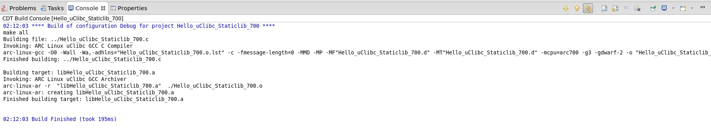

Building Linux uClibc applications
==================================

The C Project dialog has five ARC project types on Linux:  ARC Cross ELF32
Target Application, ARC Cross ELF32 Target Static Library,   ARC Cross uClibc
Target Application, ARC Cross uClibc Target Shared Library and ARC Cross uClibc
Target Static Library.

Creating a New C Project
------------------------

1. Select File >New >C Project

   C Project Types on Linux

Choosing toolchain
------------------

1. Choose proper toolchain for uClibc project type.

.. figure:: images/uclibc/uclibc_toolchain.png

   uClibc supported toolchain

Setting compile options based on CPU core
-----------------------------------------

User should choose a proper toolchain for a core, for different core supports different compile options.

Compiling a uClibc application
------------------------------

1. Select File >New >C Project

   Hello_uClibc_Application

2. Getting compiling output in console

   Hello_uClibc_Application_700_output

Compiling a uClibc Static Library
---------------------------------

1. Select File >New >C Project

   Hello_uClibc_Staticlib

2. Getting compiling output in console

   Hello_uClibc_Staticlib_700_output

Compiling a uClibc Shared Library
---------------------------------

1. Select File >New >C Project

   Hello_uClibc_Sharedlib

2. Getting compiling output in console

   Hello_uClibc_Sharedlib_700_output
