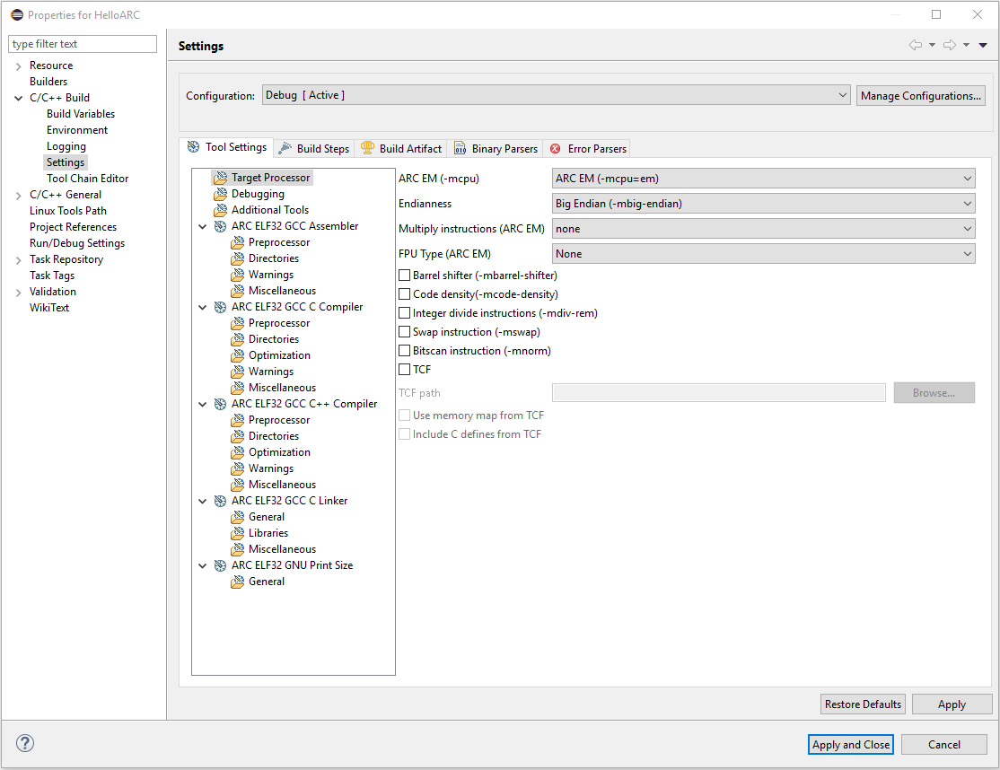
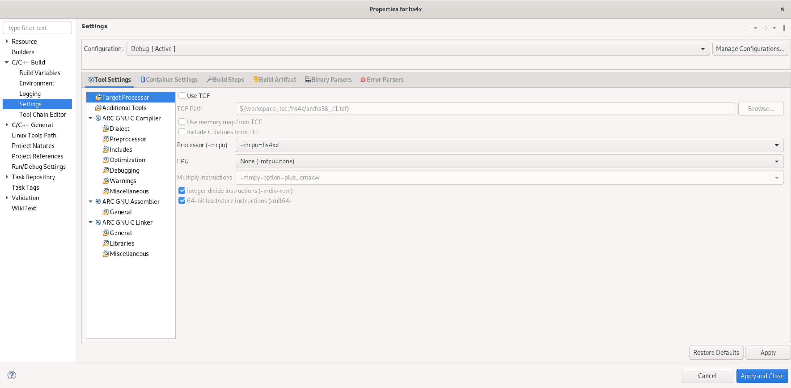

.. _building-user-guide:

Building User Guide
===================

Project Build Settings
----------------------

To see your project build settings, right click on your project and select
**Properties** from the pop-up menu. In the appeared dialog choose
**C/C++ Build > Settings**, then select **Tool Settings** tab.

   Project Build Settings page

At the left of the tab there is a list of tools which are used to build your
project and **Target Processor**, **Debugging** and **Additional Tools** pages.
For each of the listed tools there are some pages where you can set properties
for these tools.

Target Processor Page
---------------------

On this page there are properties that describe your target. These properties
are different for different processors.

   Target Processor Page for ARC HS

CPU option
----------

CPU option for ARC 600 and ARC 700 has only one value, but for ARC EM there
are several possible values: ``arcem``, ``em``, ``em4``, ``em4_dmips``, ``em4_fpus``
and ``em4_fpuda``. Possible values for ARC HS CPU are ``archs``, ``hs``, ``hs34``,
``hs38`` and ``hs38_linux``. For each of these values there are precompiled standard
libraries that use some other target options. For example, if you choose ``hs34``
as you CPU, standard library that uses atomic functions and multiply
option "mpy" will be used. Values of these options are set in IDE when CPU is
selected and can not be changed to weaker values without changing CPU. For
example, if DP FPU is selected as a result of selecting CPU, you can not change
it to any of SP FPU values or "None", but you can change it to DP FPU with extensions.

.. figure:: images/building/hs34_selected.png

  ARC HS Target Processor Page with ``hs34`` selected as CPU value

Here are the options that are required for each of CPU values:

.. table::

   ========= ======== ====================== ============== ============ ============== ======= ====
   CPU       Multiply FPU                    Barrel shifter Code density Integer divide Bitscan Swap
   ========= ======== ====================== ============== ============ ============== ======= ====
   arcem     wlh1     none                   \+             \+           \-             \-      \-
   em        none     none                   \-             \-           \-             \-      \-
   em4       none     none                   \-             \+           \-             \-      \-
   em4_dmips wlh1     none                   \+             \+           \+             \+      \+
   em4_fpus  wlh1     SP FPU                 \+             \+           \+             \+      \+
   em4_fpuda wlh1     FPU with double assist \+             \+           \+             \+      \+
   ========= ======== ====================== ============== ============ ============== ======= ====

.. table::

   ========== ========== ========================== ============== ================= ======
   CPU        Multiply   FPU                        Integer divide 64-bit load/store Atomic
   ========== ========== ========================== ============== ================= ======
   archs      mpy        none                       \+             \+                \+
   hs         none       none                       \-             \-                \-
   hs34       mpy        none                       \-             \-                \+
   hs38       plus_qmacw none                       \+             \+                \+
   hs38_linux plus_qmacw DP FPU with all extensions \+             \+                \+
   ========== ========== ========================== ============== ================= ======

.. note::

   Note that if you use TCF to provide target options, there are no checks that
   option values are consistent with CPU and you can specify there values that
   are weaker than CPU value requires. So please be careful when editing TCFs.

Other options and TCF
---------------------

* Endianness is set when you choose a toolchain for your project and can not be
  changed.
* Other architecture options you can either set manually or choose a TCF file
  for used CPU core (available only for ARC EM and HS), which will set these options
  automatically. The only option that is not set automatically by selecting
  a TCF file is **ABI selection** option, which is available only for ARC HS processors.

.. figure:: images/building/target_tcf_selected.png

   Target Processor Page for ARC HS with TCF checkbox selected

It is recommended to use TCF files, because they are generated from the Build
Configuration Registers and thus most reliably describe target core.
TCF files are provided by your chip designer.

To see which options are set automatically if TCF is chosen, you can select a
tool from the list on the left of the dialog and see the list of options to be
passed to this tool in the **All options** field.

.. figure:: images/building/compiler_options_list.png

   List of all the options to be passed to compilerx

If **TCF** is selected, **Use memory map from TCF** and **Include C defines from TCF** checkboxes become enabled.
If you check **Use memory map from TCF** box, memory map from TCF file will be
passed to the linker. Checking **Include C defines from TCF** includes C defines from TCF.

Note that templates from **AXS10x Projects** and **EM Starter Kit Projects**
already contain memory maps that are used if no other is provided. However,
this is true only for **Hello World for EM SK** and **Empty Project For**
templates, but not **Empty Project** ones. **Empty Project** templates are
generated automatically by Eclipse and do not contain any specific information.

   Memory map for **Hello World for EM SK 2.1 Project**
