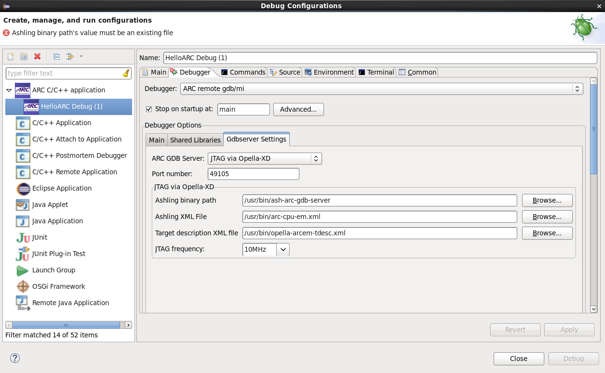
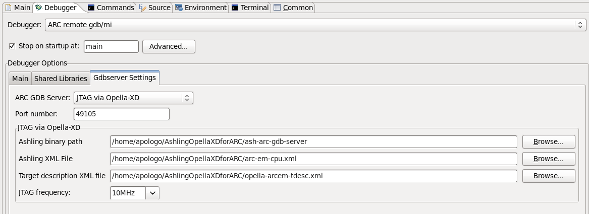
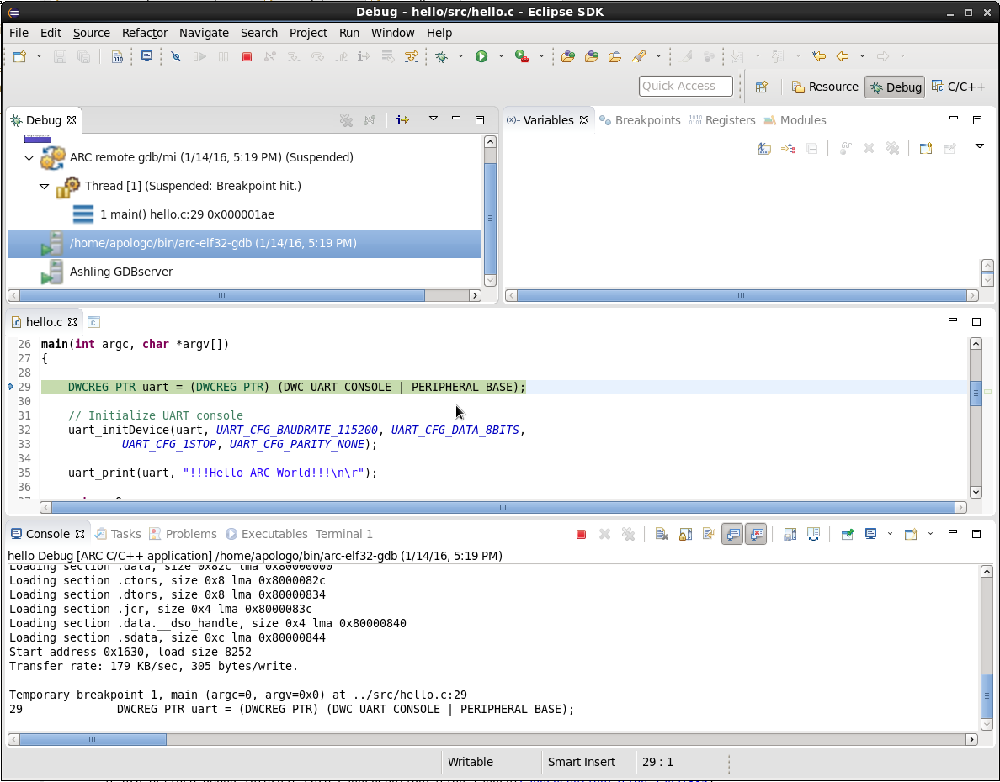

Debugging with OpellaXD
=======================

It is expected here that you have already built your application and created a
debug configuration for it. About how to do it you can read on the following
pages:

* :ref:`Building an Application <building-user-guide>`
* :ref:`Creating a Debug Configuration <creating-a-debug-configuration>`

.. note::
   Opella-XD has some problems, see section :ref:`known-issues`.

Board Configuration
-------------------

Board should be configured mostly the same way as for OpenOCD, see :ref:`Board Configuration
<debugging-with-openocd-board-configuration>`.

However, it might be needed to change some jumper settings comparing to
OpenOCD. For example, to use Opella-XD with EM Starter Kit 1.1 you should set J8 jumper.
Refer to the User Guide of EM Starter Kit or AXC00x CPU Card you are using.

Specifying properties for Opella-XD
-----------------------------------

   Opella-XD on debugger tab

In this tab you should specify paths to your ashling executable file and two XML
files. Both these files you can find `here <https://github.com/foss-for-synopsys-dwc-arc-processors/toolchain/tree/arc-staging/extras/opella-xd>`_.
In the **Ashling XML File** field you should choose one of ``arc600-cpu.xml``,
``arc700-cpu.xml``, ``arc-em-cpu.xml`` and ``arc-hs-cpu.xml``. In the
**Target description XML file** should be path to ``opella-YOUR_CPU-tdesc.xml``.

**JTAG frequency** should be set to **7 MHz** for EM Starter Kit 2.0 and 2.1.
For EM Starter Kit 2.2 select **5 MHZ**. For other hardware development systems
leave **10 MHz**.

.. note::
   Note that if you are using Opella-XD, you can not specify the core to debug,
   so you will be able to debug your application only if you have just one core
   in your JTAG chain.

Starting a debug session
------------------------

To debug an application using OpenOCD, press **Debug** button of IDE and confirm
switching to Debug Perspective.

   Opella-XD properties

   Debugging process with Opella-XD

