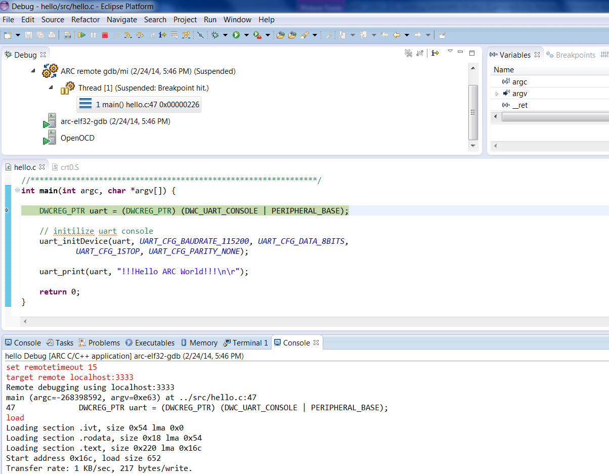

Debugging with OpenOCD
======================

It is expected here that you have already built your application and created a
debug configuration for it. About how to do it you can read on the following
pages:

* :ref:`Building an Application <building-user-guide>`
* :ref:`Creating a Debug Configuration <creating-a-debug-configuration>`

.. _debugging-with-openocd-board-configuration:

Board Configuration
-------------------

For AXS 10x board configuration refer to :ref:`openocd-axs-board-configuration`
and User Guide of AXC00x CPU Card you are using.

For EM Starter Kit use default configuration.

Configuring drivers on Windows
------------------------------

If you are using Windows, you should configure drivers for your device before
you start.

About how to do it see :ref:`How to Use OpenOCD on
Windows <how-to-use-openocd-on-windows>`.

Specifying OpenOCD properties
-----------------------------

   OpenOCD debugger tab

In this tab you can choose your development system and then in the **OpenOCD
configuration file** field you will see a path to a file that will be used by
OpenOCD. If you want to use another configuration file, you can choose **Custom
configuration file** under **Development system** and select your own file in the
enabled **OpenOCD configuration file** field.

Choosing COM Port
-----------------

Open **Terminal** tab and select COM Port from the list. On Linux select
**/dev/ttyUSB1** for EM Starter Kit and **/dev/ttyUSB0** for AXS10x. On Windows
select COM port matching the port number from "Devices and Printers":

   USB Serial COM Port

Starting a debug session
------------------------

To debug an application using OpenOCD, press **Debug** button of IDE and confirm
switching to Debug Perspective.

   Debugging Process
