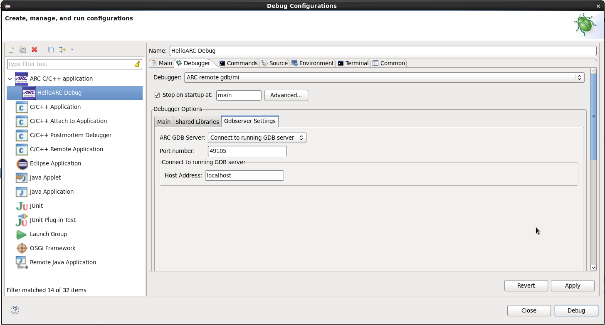
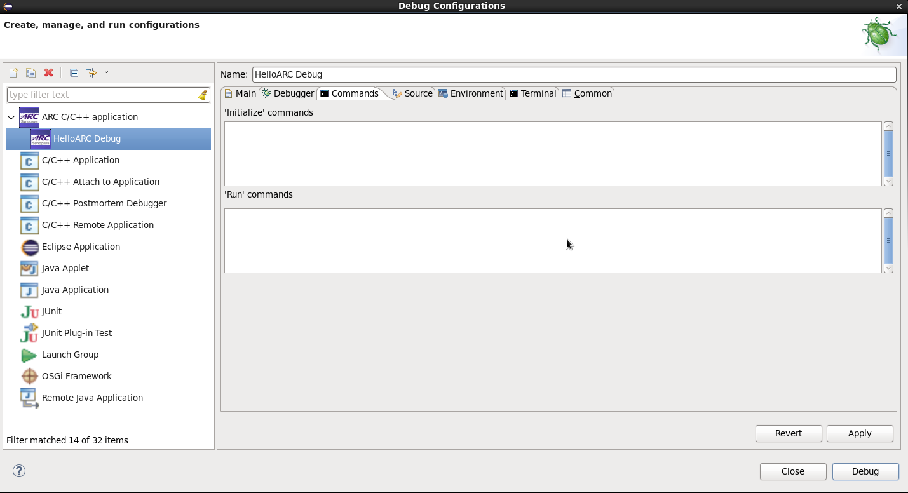
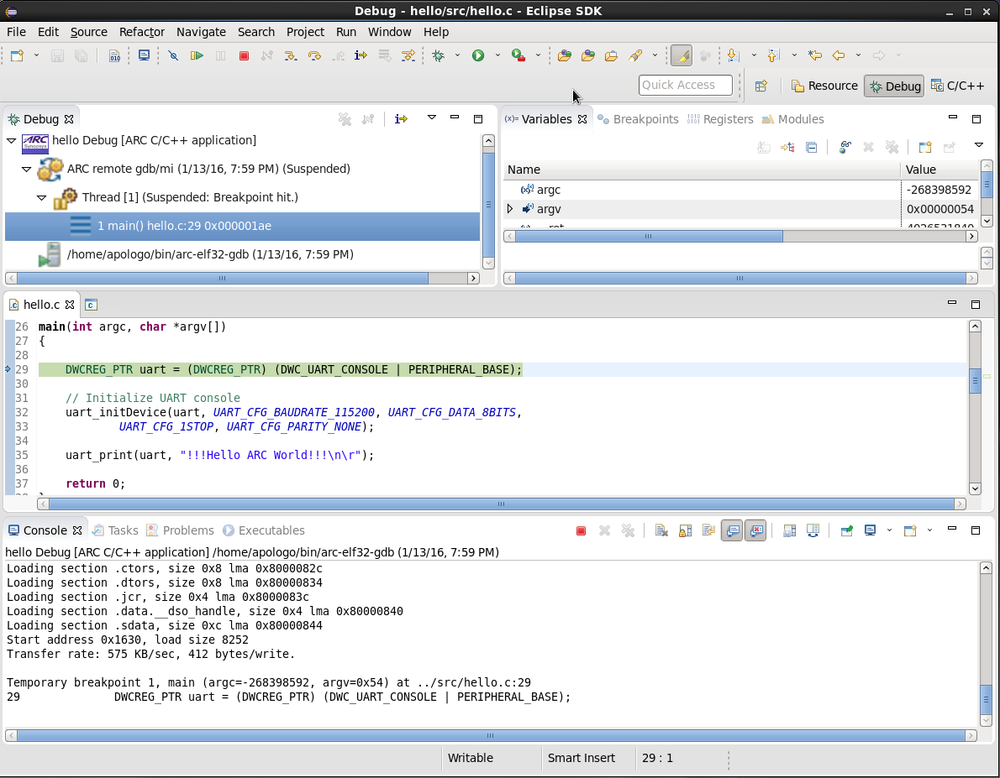
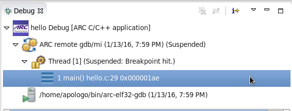
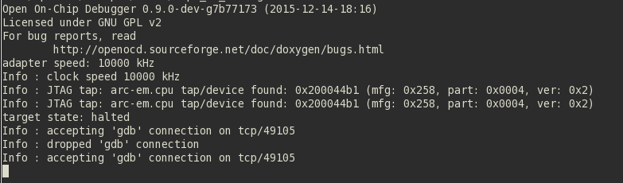

Debugging with Running GDB Server
=================================

It is expected here that you have already built your application and created a
debug configuration for it. About how to do it you can read on the following
pages:

* :ref:`Building an Application <building-user-guide>`
* :ref:`Creating a Debug Configuration <creating-a-debug-configuration>`

Running GDB server properties
-----------------------------

   Connect to running GDB server tab

If you want to connect to a GDB server that is already running, you should choose
a host address and also specify commands to be passed to the GDB client on the
**Commands** tab.

   Commands tab

OpenOCD as running GDB server
-----------------------------

If you have a running OpenOCD server, you can connect to it just by choosing
**Connect to running GDB Server** under **ARC GDB Server** on **Debugger**
tab and specifying port number and host address on which your OpenOCD is
running. You do not need to specify any initialize commands for GDB in
**Commands tab**, it will connect to OpenOCD using host address and port number
from **Debugger** tab.

   Debugging using running GDB server

   Debug window

   OpenOCD output in console