Getting Started with nSIM
=========================

Prerequisites
--------------------

You should have nSIM installed on your computer.

You also might need to set environment variable **LM_LICENSE_FILE** =<your_license>
in case if you have full nSIM version. Otherwise you will get licensing failure.

Creating a C project
--------------------

1. Select **File >New >C Project**

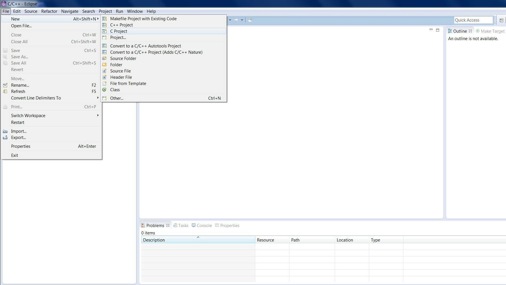

   Creating a new C project

In **C Project** window select **Hello World C Project** under **ARC Cross ELF32 Target Application** project type.
On the right side of the window there is a list of available toolchains, select **GNU Toolchain for ARC EM**.
If you do not see this toolchain in the list or this project type in the list of project types, make sure that ARC EM
toolchain compiler is in the ``PATH`` environment variable or at ``../bin/`` directory relative to Eclipse executable.

2. Enter a project name

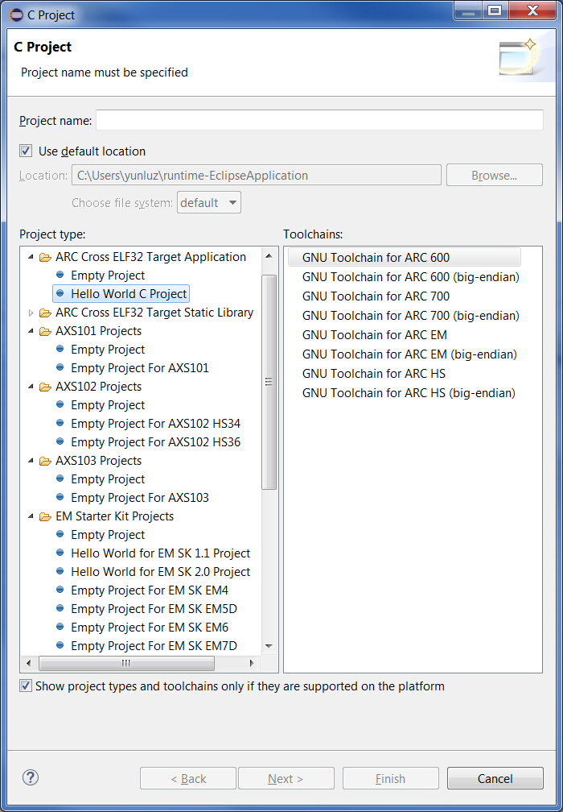

   C Project Creation Dialog

After that you can click **Finish** or you can click **Next** and fill in additional information about your project.

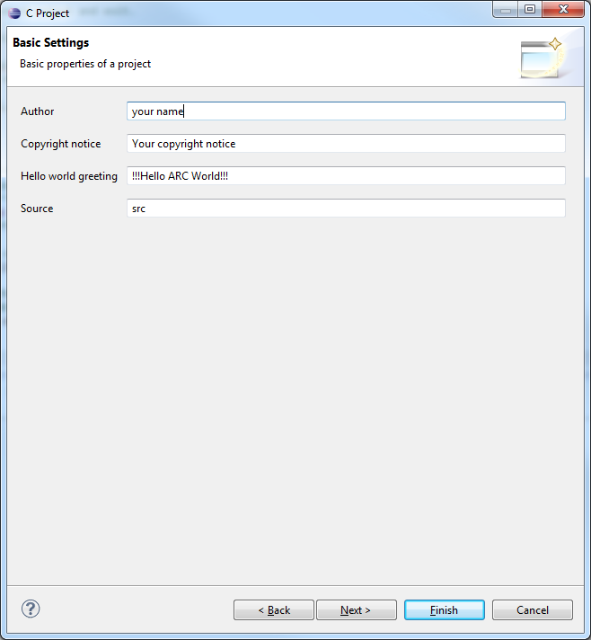

   C project creation: Additional information Dialog

Select the desired configuration and click **Finish**.

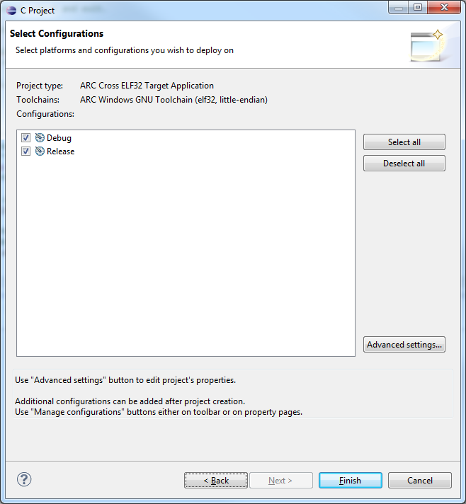

   C Project creation: Configurations Dialog

The resulting Hello World project created in Eclipse is:

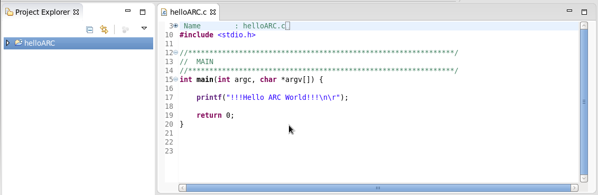

   C Project for nSIM debugging
   
   To change -mcpu option: Right click on project and select **Properties** (or **Alt + Enter**)
   
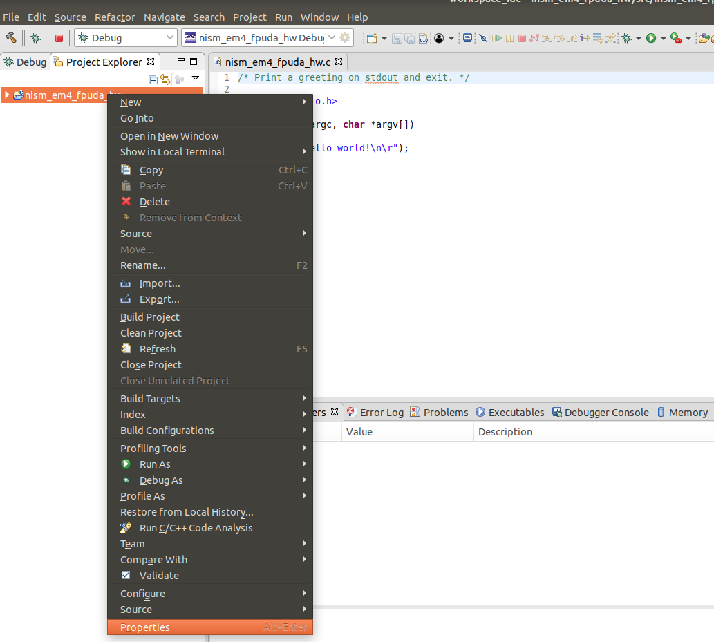
   
   C Project Properties

   Then click **C/C++ Build** -> **Target Processor** and choose required option option
   
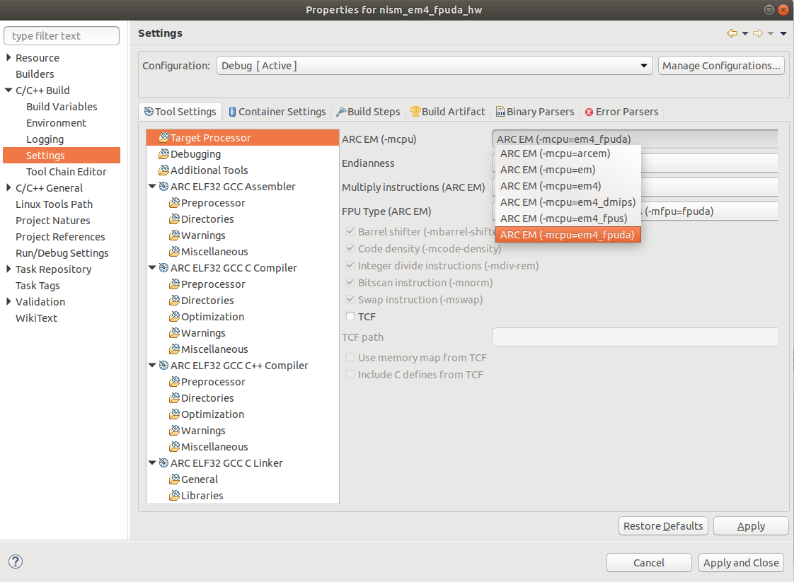

   C Project -mcpu options

Building the project
--------------------

.. note::

   Simple "Hello world" application may be too big to fit into ICCM of a typical
   ARC core, because ``printf()`` function pulls in a lot of infrastructure which
   is usually not present in embedded applications. For demonstration purposes it
   is recommended to use TCF templates with an external memory instead of CCM.
   Otherwise there would be a warning from the linker during application build
   and application may not run correctly on nSIM. So, to run "Hello world"
   example it is not recommended to use any of ``em4*``, ``em5*``, ``em9*``, or ``hs34*``
   templates.

1. Right click on the `Hello World project` and select **Build Project** from the pop-up menu

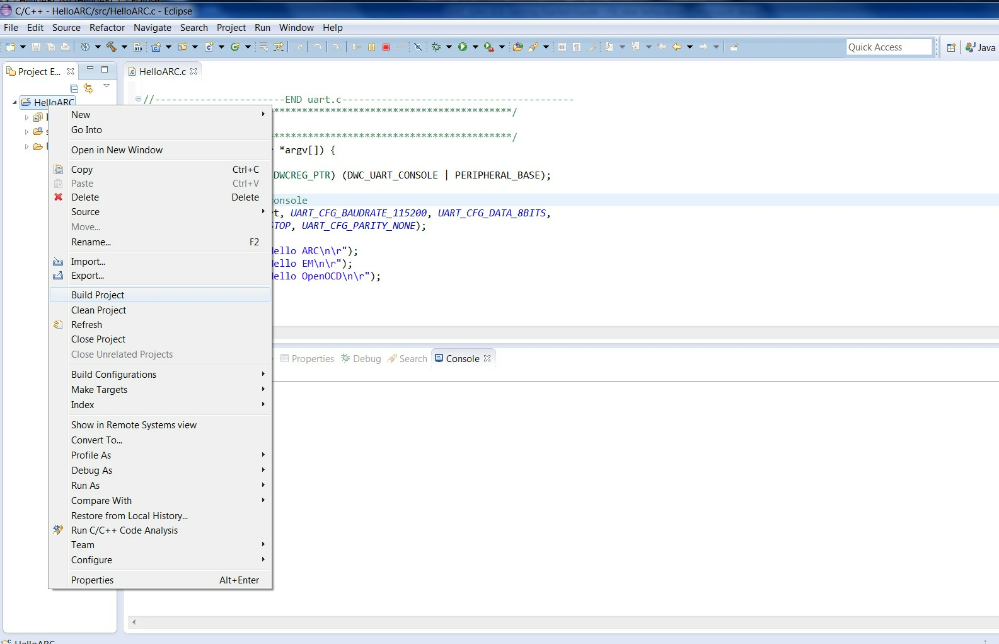

   Building a Project

2. Review the build output log in the Eclipse console tab to confirm success:

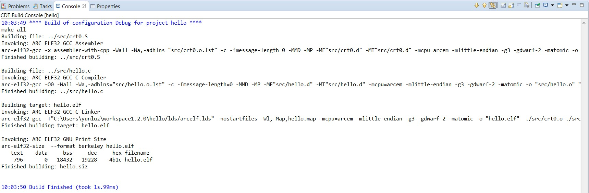

   Build Output

Debugging the project
---------------------

1. Select **Debug Configurations**  from the  **Run**  menu or by clicking on
   the down arrow next to the bug icon:

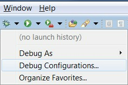

   Debug Configurations

2. Double click on the **ARC C/C++ Application**  or click on the top left icon
   to create a new debug configuration for the project:

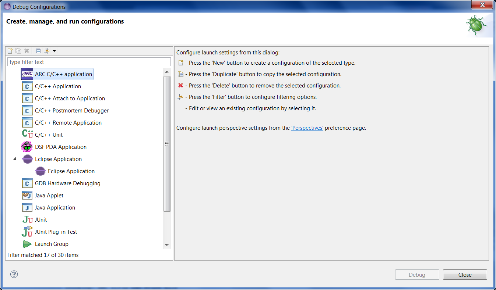

   ARC Embedded Debug Configurations

3. Select a name for the new debug configuration (by default, it equals the
   project name followed by "Debug").

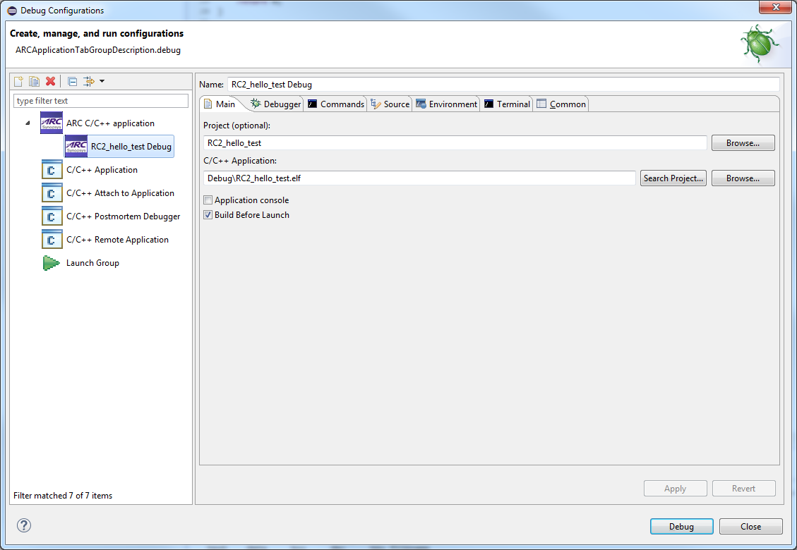

   New debug Configuration

4. Click the **Debugger** tab and select **Gdbserver Settings** page.

.. figure:: images/debugging/debugger_tab_default.jpg

   Default values in the Debugger tab

Select **nSIM** in the **ARC GDB Server** droplist.

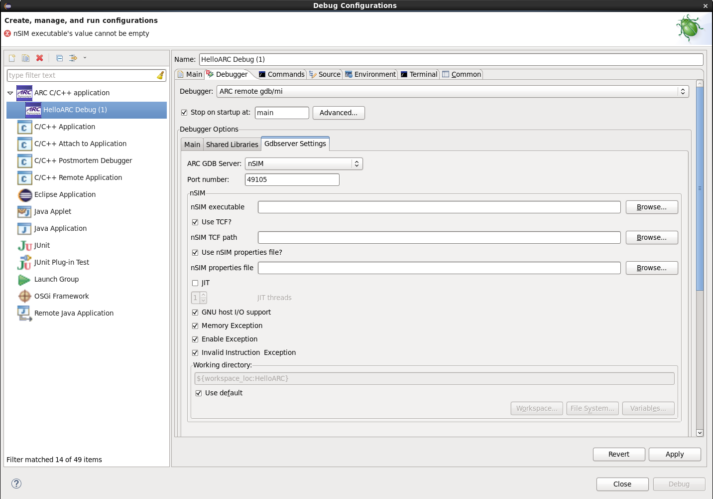

   Choosing nSIM on debug tab

In this tab you should specify paths to nSIM executable and to a TCF file.
nSIM has several TCF file templates in the folder ``../etc/tcf/templates`` relative
to nSIM executable file. Choose `em6_dmips.tcf` file from templates. Then uncheck
**Use nSIM properties file?** checkbox and click **Apply** button.

If you choose big endian toolchain, then you need to change .tcf file
because it is configured for little endian case. Open your .tcf file
and find **nsim_isa_big_endian** option in nsim.props field. Set it's
value to **1**. This way nSIM will be configured for big endian.

5. To debug application using nSIM, press "Debug" button of IDE.

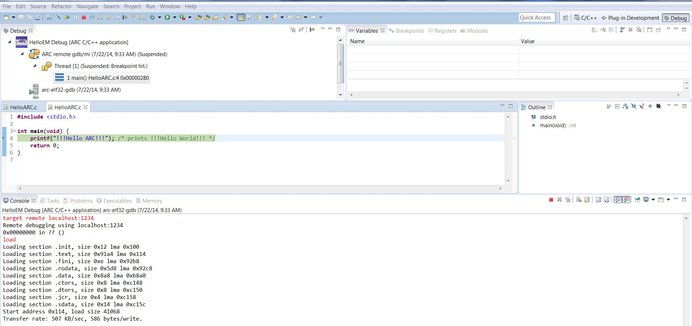

   Debugging with nSIM gdbserver

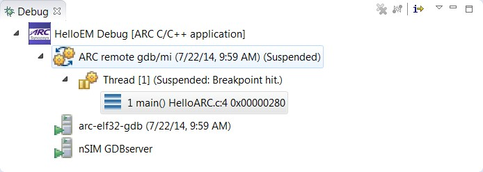

   Debug Window

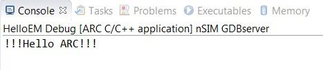

   nSIM gdbserver output in console
