Using Debug Perspective
=======================

The **Debug** perspective provides an integrated debug environment with
individual windows to display various debugging data such as the debug stack,
variables, registers  breakpoints, etc.

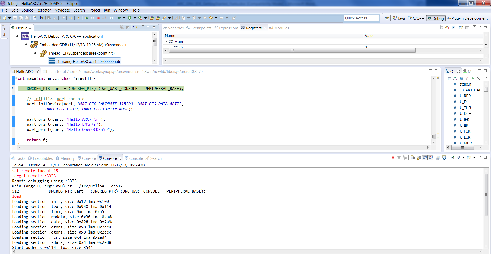

   Debug Perspective

1. To set a breakpoint, place your cursor on the marker bar along the left edge
   of the editor window on the line where you want the breakpoint:

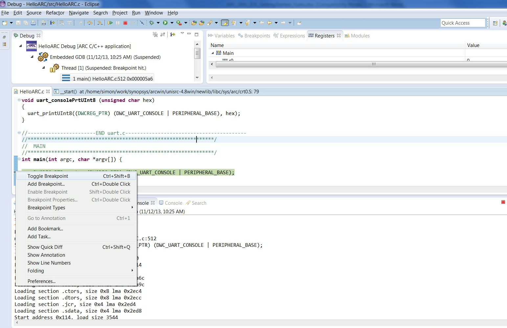

   Source File Window in Debug Perspective with Breakpoint Set

2. Examine Variables, Breakpoints, Expressions or Registers from different tabs
   of the same debug perspective:

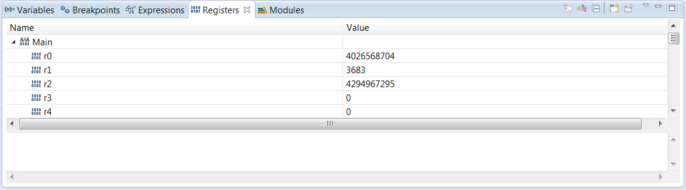

   Registers Window in Debug Perspective

3. Examine the debug Views showing the debugger in use:

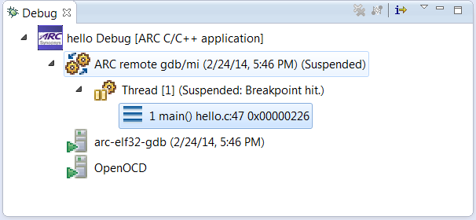

   Debug Window in Debug Perspective

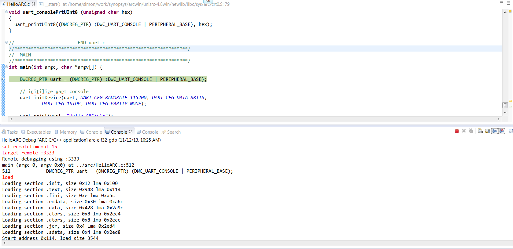

   Hello ARC Debug Console in Debug Perspective

4. Switch Console tabs to view OpenOCD **Console** output:

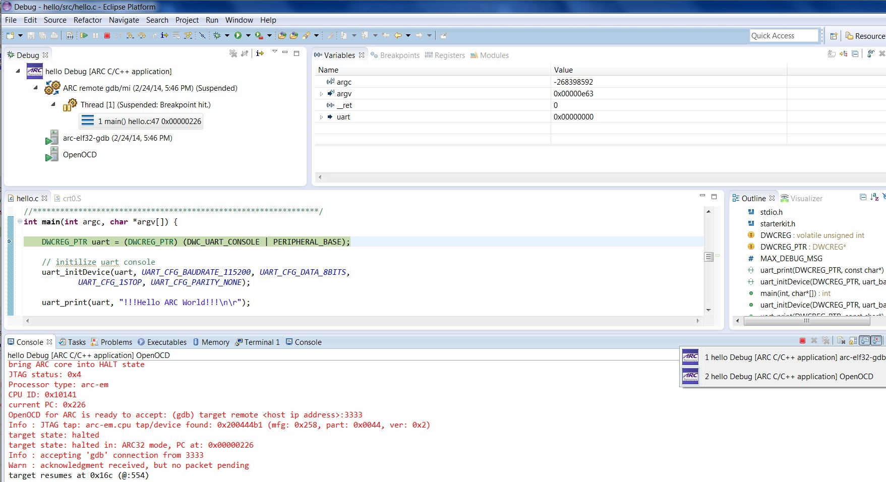

   Multiple Consoles in the Debug Perspective

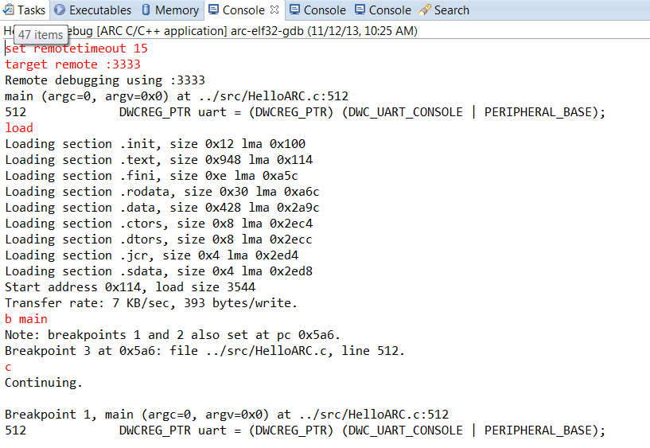

   Hello ARC Debug Console Output

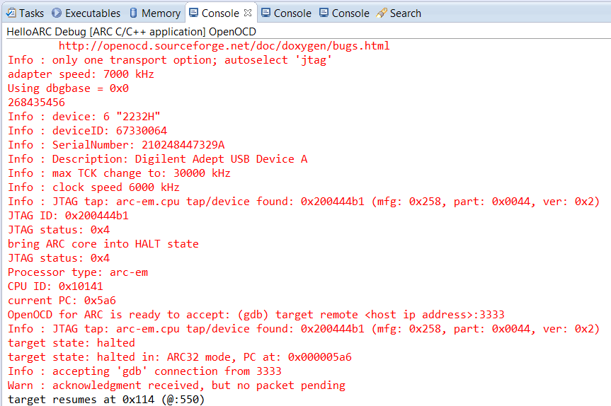

   OpenOCD Console Output

5. Step through each line by using F5 (step into), and F6 (step over).

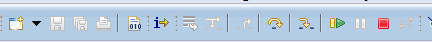

   Stepping Toolbar

6. Toggle breakpoint at the last line of main(), which is "}" , and then
   click Resume or press F8.

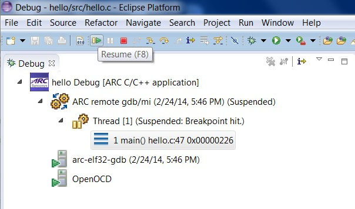

   Click Resume or Press F8

7. To see the UART output, open Eclipse Terminal view.

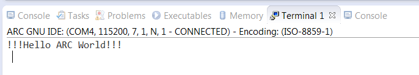

   Final Output Printed to Serial Terminal Window through UART

   You will be able to see the output in the Terminal view only if COM port
   specified in **Terminal** tab of **Debug Configurations** dialog is right.
   Read more about specifying a COM port :ref:`setting-a-com-port`

8. Terminate all external tools before you quit current debugging process.

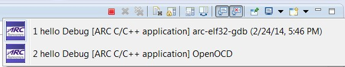

   Consoles for child processes